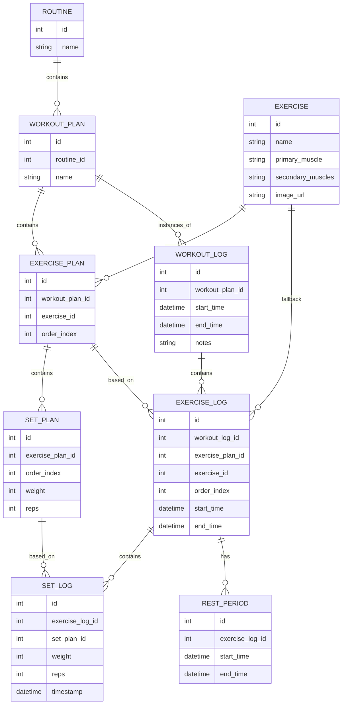

# SQLDelight Database Structure Analysis (2025-04-18)

This document summarizes the analysis of the SQLDelight database structure found in `data/db/src/commonMain/sqldelight/app/shapeshifter/data/db/`.

## Mermaid ERD

## Analysis Summary & Potential Issues

*   **Overall Structure:** The database correctly separates planning (`*_plan`) from logging (`*_log`). It uses intermediate tables (`exercise_plan`) for many-to-many relationships effectively. The logging follows a clear hierarchy: `workout_log` -> `exercise_log` -> `set_log`.
*   **Redundancy in Log Tables:**
    *   `exercise_log` stores `workout_plan_id`, which is also available via `workout_log_id` -> `workout_log.workout_plan_id`.
    *   `set_log` stores `workout_plan_id`, `workout_log_id`, `exercise_plan_id`, and `exercise_id`. These seem derivable from `exercise_log_id` -> `exercise_log`. While potentially added for query performance (avoiding joins), this increases storage and complexity, and risks data inconsistency if not managed carefully. Consider if indices on `exercise_log_id` are sufficient.
*   **`exercise_session.sq` Query Bug:** The subqueries fetching previous set data (`set_prev_reps`, `set_prev_weight`) use `NULLIF(x, x)` which will always return `NULL`. This needs correction.
*   **`rest_time` Table:** Its purpose is unclear. It links `exercise_log` and `workout_log` but stores no duration or timestamp. The rest duration seems to be in `exercise_log.rest_time_duration`. This table might be unnecessary or incomplete.
*   **Unclear Columns:**
    *   `workout_log.rest_finish_at`: What does this timestamp represent? The end of the *last* rest period in the workout?
    *   `set_log.set_type_index`: What does this index signify? Is it just the order (1st set, 2nd set), or does it represent types like Warmup, Working Set, Drop Set, etc.? Needs clarification.
*   **Nullable `exercise_plan_id`:** In `exercise_log` and `set_log`, this allows logging exercises/sets not part of the original plan (ad-hoc additions), which seems like reasonable flexibility.
*   **Naming:** Generally consistent, but `workout_plan_session.sq` and `exercise_session.sq` contain queries, not table definitions, which could be slightly confusing. Maybe rename them to `workout_session_queries.sq` or similar if that convention is preferred.
